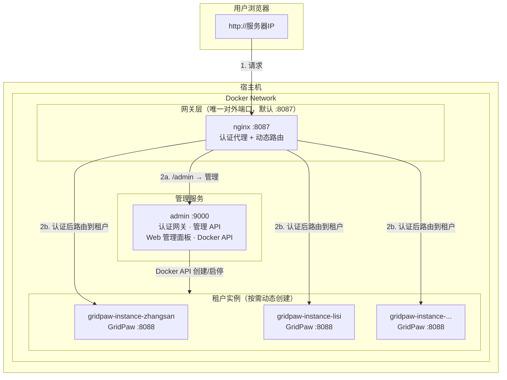

# GridPaw 多租户部署方案

基于 Docker Compose 的多租户部署方案。每个租户运行独立的 GridPaw 容器实例(其镜像基于官方agentscope/copaw构建而来)，通过 Nginx 网关统一认证和路由，通过 Web 管理面板动态管理租户和容器。

## 架构

```
                        用户浏览器  http://服务器IP
                                  │
                                  │ 1. 请求
                                  ▼
┌─────────────────────────────────────────────────────────────────────┐
│ 宿主机 · Docker Network                                               │
│                                                                       │
│  ┌─────────────────────────────────────────────────────────────────┐ │
│  │ 网关层（唯一对外端口，默认 :8087）                                    │ │
│  │   nginx · 认证代理 + 动态路由                                       │ │
│  └─────────────────────────────┬───────────────────────────────────┘ │
│                                │                                      │
│        2a. /admin              │              2b. 认证后路由到租户      │
│            │                   │                      │               │
│            ▼                   │                      ▼               │
│  ┌─────────────────────┐       │       ┌─────────────────────────────┐│
│  │ 管理服务             │       │       │ 租户实例（按需创建）          ││
│  │ admin :9000         │       │       │ · gridpaw-instance-zhangsan  ││
│  │ 认证 · 管理 API     │   ─────┼─────►│ · gridpaw-instance-lisi      ││
│  │ Web 面板 · Docker   │  Docker API  │ · gridpaw-instance-...       ││
│  │ API                │  创建/启停    │   (GridPaw :8088)            ││
│  └────────────────────┘               └─────────────────────────────┘│
└─────────────────────────────────────────────────────────────────────┘
```



- **gridpaw-nginx**：唯一对外端口；对业务请求做认证校验（委托 admin），按登录用户动态路由至对应租户或 admin
- **gridpaw-admin**：认证服务（`/auth/`）+ 租户管理 API + Web 管理面板 + 共享文件服务；通过 Docker API 按需创建/启停租户容器
- **gridpaw-instance-{user_id}**：租户 GridPaw 实例，由 admin 按需创建，不纳入 docker-compose 静态编排；容器名前缀可通过 `INSTANCE_PREFIX` 配置

## 文件说明

```
deploy_tenant/
├── .env                        # 部署配置（端口、镜像名、数据目录等，仅需按环境调整的项）
├── prepare.sh                  # 部署准备工具(shell版本)
├── prepare.py                  # 部署准备工具(python版本)
├── docker-compose.yml          # 静态编排：仅 nginx + admin
├── admin-service/              # 认证 + 管理服务
│   ├── Dockerfile
│   ├── main.py                 # FastAPI: 认证 API + 管理 API + 分发 API
│   ├── db.py                   # SQLite 租户数据层
│   ├── docker_manager.py       # Docker API 封装
│   ├── requirements.txt
│   ├── login.html              # 用户登录页
│   ├── admin.html              # 管理面板页面
│   └── static/                 # 静态资源（jQuery、jsTree，用于分发目录树）
├── nginx/
│   ├── Dockerfile              # Nginx 镜像（含 tzdata 时区）
│   └── nginx.conf              # Nginx 静态配置
├── gridpaw.Dockerfile          # GridPaw 租户镜像构建文件
├── data/                       # Admin 数据目录（默认 GRIDPAW_ADMIN_DATA_DIR，说明见上文「Admin 数据目录说明」）
│   ├── db/
│   │   └── admin.db            # SQLite 数据库（运行时自动创建）
│   └── tenant_working_templates/  # 租户目录结构模板（对标容器 /app，含 working、working.secret 等）
└── images/                     # (export 时生成)
    ├── gridpaw-nginx.tar
    ├── gridpaw-admin.tar
    └── gridpaw-tenant.tar
```

## Prepare 工具介绍

**Prepare** 是本方案的部署准备工具，封装 `docker` / `docker compose` 操作，用于构建镜像、启停服务、导出/导入镜像等。使用 prepare 可避免手写复杂的 docker 命令。

### 两种实现

| 脚本 | 语言 | 适用场景 |
|------|------|----------|
| `prepare.sh` | Bash | **推荐**，本地和 Linux 服务器均可直接使用 |
| `prepare.py` | Python 3 | 无 Bash 时（如部分 Windows 环境）可替代使用 |

二者功能等价，命令用法一致。

### 基本用法

在 `deploy_tenant` 目录下执行：

```bash
./prepare.sh <命令> [参数]      # Bash 版本
python prepare.py <命令> [参数] # Python 版本
```

### 命令列表

完整列表也可运行 `./prepare.sh help` 或 `python prepare.py help` 查看。

| 命令 | 说明 |
|------|------|
| `build [nginx\|admin\|gridpaw]` | 构建镜像（可指定目标，默认全部） |
| `up [nginx\|admin]` | 创建并启动（可指定服务，默认全部） |
| `down [nginx\|admin]` | 停止并删除（可指定服务，默认全部） |
| `start [nginx\|admin]` | 启动已存在的容器（可指定服务） |
| `stop [nginx\|admin]` | 停止（可指定服务） |
| `restart [nginx\|admin]` | 重启（可指定服务） |
| `status` | 查看容器运行状态 |
| `logs [service]` | 查看日志（可指定某个服务） |
| `export` | 导出镜像为 tar 文件（用于内网部署，需先 build） |
| `import [dir]` | 从 tar 文件导入镜像 |
| `prune` | 删除悬空镜像（rebuild 后产生，仅 `prepare.sh` 支持） |

## 快速开始

### 1. 编辑部署配置

复制 `.env.example` 为 `.env`（若尚未存在），然后修改 `.env`：

> **注意**：`.env` 被 git 忽略。当项目更新 `.env.example` 时，需**手动同步**到 `.env`，否则会继续使用旧配置。

`.env` 只包含真正需要按部署环境调整的变量，其余配置（管理员账号密码、内部端口、容器内目录结构等）已在代码中固定：

```env
NGINX_PORT=8087                         # Nginx 对外端口（唯一对用户暴露的端口）
TENANT_IMAGE=gridpaw-tenant:latest      # GridPaw 租户镜像名（需与 build 产物一致）
INSTANCE_PREFIX=gridpaw-instance-       # 租户容器命名前缀（默认无需修改）
GRIDPAW_ADMIN_DATA_DIR=./data           # Admin 数据目录（含 db/、tenant_working_templates/，可改为绝对路径）
TENANTS_DATA_BASE_DIR=/var/gridpaw/tenants_data # 租户数据根目录（各机器路径不同）
SHARED_FILES_DATA_DIR=/var/gridpaw/shared_files  # 共享文件服务宿主机存储目录
FILE_SERVICE_BASE_URL=http://127.0.0.1  # 共享文件对外访问地址（scheme+host，端口自动补充）
```

### 2. 构建镜像 & 启动

执行 `./prepare.sh build` 和 `./prepare.sh up`。详见 [Prepare 工具介绍](#prepare-工具介绍)。

### 3. 管理租户

浏览器访问 `http://服务器IP:8087/admin/`（端口由 `.env` 中 `NGINX_PORT` 决定，默认 `8087`），用管理员账号（admin/admin）登录管理后台。

在管理面板中：
- **新增租户**：填写用户 ID、姓名、密码
- **批量导入**：上传 JSON 文件批量创建租户
- **批量分发**：勾选租户后点击「分发」，从模板目录选择文件/目录批量同步到各租户数据目录
- **启动实例**：点击「启动」按钮，admin 自动创建 Docker 容器
- **停止/重建**：在管理面板上操作（重建会删除并重新创建容器）
- **查看日志**：点击「日志」查看容器输出

### 4. 用户登录

浏览器访问 `http://服务器IP:8087/`（端口由 `.env` 中 `NGINX_PORT` 决定，默认 `8087`），使用管理员分配的账号登录，自动路由到对应的 GridPaw 实例。

## 内网部署（无法联网的服务器）

在有网机器上执行 `prepare build`、`prepare export`；将整个 `deploy_tenant` 目录（含 `images/*.tar`）拷贝至内网；在内网执行 `prepare import`、编辑 `.env`、`prepare up`，随后浏览器访问管理面板添加租户。详见 [Prepare 工具介绍](#prepare-工具介绍)。

需要导出的 3 个镜像：

| 镜像 | 来源 | 用途 |
|------|------|------|
| `gridpaw-nginx:latest` | nginx/Dockerfile | 网关路由（基于 nginx:alpine + tzdata） |
| `gridpaw-admin:latest` | admin-service/Dockerfile | 认证 + 管理 |
| `gridpaw-tenant:latest` | gridpaw.Dockerfile | GridPaw 智能助手（租户版） |

## 日常管理

日常运维（查看状态、日志、重启等）使用 prepare，详见 [Prepare 工具介绍](#prepare-工具介绍)。租户和 GridPaw 实例的管理全部在 Web 管理面板上完成。

## 代码更新与生效方式

修改 admin 服务或 nginx 的代码/配置后，生效方式因改动类型而异。以下均基于 **docker-compose.yml 的默认卷挂载**（`./admin-service`、`./nginx/nginx.conf` 映射到容器）。

### 1. 需重新构建并重建容器

**适用场景**：修改了镜像构建相关或依赖项，必须重新打镜像。

| 改动内容 | 说明 |
|----------|------|
| `admin-service/Dockerfile` | 镜像构建步骤变化 |
| `admin-service/requirements.txt` | Python 依赖变化 |
| `nginx/Dockerfile` | Nginx 镜像构建步骤变化 |
| `gridpaw.Dockerfile` | 租户镜像变化（仅影响新建/重建的租户容器） |

**操作步骤（以 admin 为例）**：

```bash
./prepare.sh build admin      # 重新构建 admin 镜像
./prepare.sh down admin      # 停止并删除旧容器
./prepare.sh up admin        # 用新镜像创建并启动容器
```

若改动的是 nginx 或 gridpaw，将 `admin` 替换为 `nginx` 或执行 `build gridpaw`；`gridpaw` 仅需 build，租户容器在管理面板中按需重建。

### 2. 需重启容器，无需重新构建

**适用场景**：修改了由挂载卷提供的文件，容器内进程需重新加载。

| 改动内容 | 说明 |
|----------|------|
| `admin-service/main.py` | FastAPI 后端逻辑，需重启以重载 Python |
| `admin-service/db.py`、`admin-service/docker_manager.py` | 同上 |
| `nginx/nginx.conf` | Nginx 配置，需重启以重载 |

**操作步骤（以 admin 为例）**：

```bash
./prepare.sh restart admin
```

或分别停止再启动：

```bash
./prepare.sh stop admin
./prepare.sh start admin
```

Nginx 同理：`./prepare.sh restart nginx` 或 `./prepare.sh restart`（重启全部）。

### 3. 无需重启，刷新页面即可

**适用场景**：修改了由挂载卷提供的、每次请求时从磁盘读取的文件。

| 改动内容 | 说明 |
|----------|------|
| `admin-service/admin.html` | 管理面板页面（每次请求读取） |
| `admin-service/login.html` | 用户登录页（每次请求读取） |
| `admin-service/static/*` | jQuery、jsTree 等静态资源 |

**操作**：保存文件后，在浏览器中刷新对应页面（F5 或 Ctrl+R）即可看到更新，无需执行任何 prepare 命令。

---

**简要对照表**：

| 改动类型 | 操作 |
|----------|------|
| Dockerfile、requirements.txt | `build` → `down` → `up` |
| main.py、db.py、docker_manager.py、nginx.conf | `restart` |
| admin.html、login.html、static/* | 刷新浏览器 |

**说明**：若部署时未挂载 `./admin-service`（例如生产环境仅用镜像内的文件），则上述 2、3 类改动均需通过「1. 重新构建并重建容器」才能生效。

## 定制某个租户的提示词

**方式一**：直接编辑该租户的数据目录（路径由 `TENANTS_DATA_BASE_DIR` 决定）：

```bash
vim {TENANTS_DATA_BASE_DIR}/zhangsan/working/AGENTS.md
vim {TENANTS_DATA_BASE_DIR}/zhangsan/working/SOUL.md
```

示例：若 `TENANTS_DATA_BASE_DIR=/var/gridpaw/tenants_data`，则路径为 `/var/gridpaw/tenants_data/zhangsan/working/`。

**方式二**：使用管理面板「分发」功能，从 `{GRIDPAW_ADMIN_DATA_DIR}/tenant_working_templates/` 选择文件/目录批量同步到选中租户，修改模板后一次分发即可更新多个租户。

在管理面板上重建对应用户的容器即可生效。

## 模板与分发

- **模板目录**：`{GRIDPAW_ADMIN_DATA_DIR}/tenant_working_templates/`（由 `.env` 中 `GRIDPAW_ADMIN_DATA_DIR` 配置，默认 `./data`）
- 模板结构对标宿主机上各租户子目录 `{TENANTS_DATA_BASE_DIR}/{user_id}/`（对应容器内 `/app`），例如 `tenant_working_templates/working/AGENTS.md` → `{user_id}/working/AGENTS.md`
- 分发时勾选租户，选择要分发的文件或目录，确认后批量复制到各租户对应路径，覆盖已存在文件

### Admin 数据目录说明

`GRIDPAW_ADMIN_DATA_DIR`（默认 `./data`）存放 admin 服务的运行时数据及 GridPaw 工作目录模板。宿主机路径可通过 `.env` 配置。

**目录结构：**（`db/` 与 `tenant_working_templates/` 在首次启动时自动创建）

- **db/**：Admin 数据库
  - **admin.db**：SQLite 数据库，存储租户配置（首次启动自动创建）
- **tenant_working_templates/**：租户目录结构模板，对标租户容器内的 `/app` 目录（即智能体工作目录 `/app/working` 与敏感配置目录 `/app/working.secret` 的父目录）；在宿主机上对应 `{TENANTS_DATA_BASE_DIR}/{user_id}/` 下各租户子目录
  - **working/**：智能体工作目录模板（对应容器内 `/app/working`），分发到各租户 `{user_id}/working/`
    - 提示词：AGENTS.md、SOUL.md、PROFILE.md、MEMORY.md、HEARTBEAT.md、BOOTSTRAP.md
    - **config.json**：应用配置（频道、MCP、agents 等）
    - **active_skills/**：默认技能（pdf、news、cron 等）
    - **customized_skills/**：用户定义创建的技能
  - **working.secret/**：敏感配置模板（对应容器内 `/app/working.secret`），分发到各租户 `{user_id}/working.secret/`
    - **providers.json**：LLM 提供商配置（含 API Key）
    - **envs.json**：环境变量（如 DASHSCOPE_API_KEY）

**从旧版迁移**（若此前使用 `data/admin.db` 和 `data/templates/` 结构）：

```bash
cd deploy_tenant/data   # 若 GRIDPAW_ADMIN_DATA_DIR 不为 ./data，请替换为实际路径
mkdir -p db
mv admin.db db/ 2>/dev/null || true
mv templates tenant_working_templates 2>/dev/null || true
```

**租户数据目录结构：**

每个租户在 `{TENANTS_DATA_BASE_DIR}` 下拥有一个独立目录（对标容器内 `/app`）：

```
{TENANTS_DATA_BASE_DIR}/
├── zhangsan/               → 容器内 /app（智能体目录的父目录）
│   ├── working/           → 容器内 /app/working（智能体工作目录）
│   └── working.secret/    → 容器内 /app/working.secret（敏感配置）
├── lisi/
│   ├── working/
│   └── working.secret/
└── ...
```

**同步模板到租户时的目标路径：**

- `tenant_working_templates/working/` 内容 → `{TENANTS_DATA_BASE_DIR}/{user_id}/working/`
- `tenant_working_templates/working.secret/` 内容 → `{TENANTS_DATA_BASE_DIR}/{user_id}/working.secret/`
- `tenant_working_templates/` 下的根级文件 → `{TENANTS_DATA_BASE_DIR}/{user_id}/` 下同名文件

### 共享文件服务

供 GridPaw 工具、外部服务（如潮流计算）写入大文件，前端可读取展示。

- **路径前缀**：`/share_files/`
- **写入**：`POST /share_files/write`
  - JSON：`{"path": "query_load_data_tool/abc.json", "content": "..."}`（文本）
  - Multipart：`path` + `file`（任意文件，含 docx、图片等）
- **读取**：`GET /share_files/YYYYMMDD/...`，无需登录
- **存储**：按日期分目录 `{SHARED_FILES_DATA_DIR}/YYYYMMDD/{path}`
- `FILE_SERVICE_BASE_URL` 只需填 scheme+host（如 `http://127.0.0.1`），端口会自动从 `NGINX_PORT` 补充

**使用前请修改**（在 `tenant_working_templates/working.secret/` 下）：

1. **providers.json**：将 `api_key` 占位符替换为真实 Key，或依赖租户 env 注入
2. **envs.json**：将 `DASHSCOPE_API_KEY` 等替换为真实值，或依赖租户 env 注入

## 故障排查

| 问题 | 排查方向 |
|------|---------|
| 管理面板无法访问 | `./prepare.sh status` 确认 nginx + admin 容器运行 |
| 用户登录后白屏 | 管理面板查看对应用户容器日志 |
| 大模型调用失败 | 检查 .env 或租户环境变量中的 API Key |
| 容器启动失败 | 管理面板查看容器日志，确认镜像已导入 |